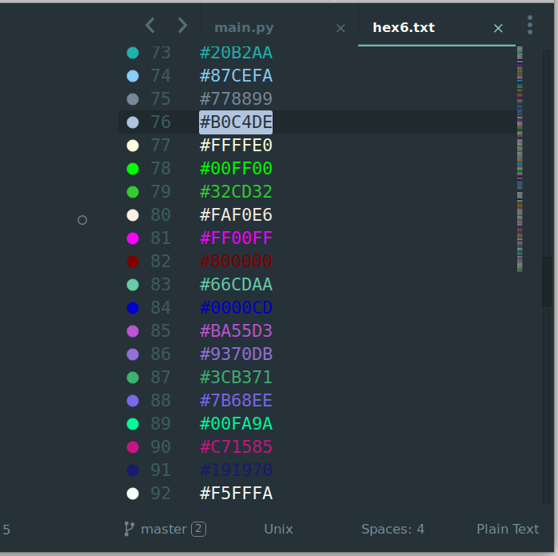
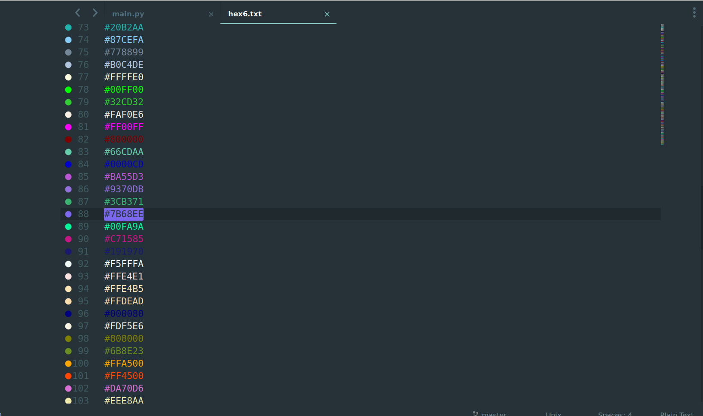

# Tincter

## What's this

Tincter is a small and fast color highlighting plugin for sublime_text.
So far, it supports colors in these formats: `hex`, `rgb`, `rgba`, `hsl` and `hsla`.

## Screenshots

